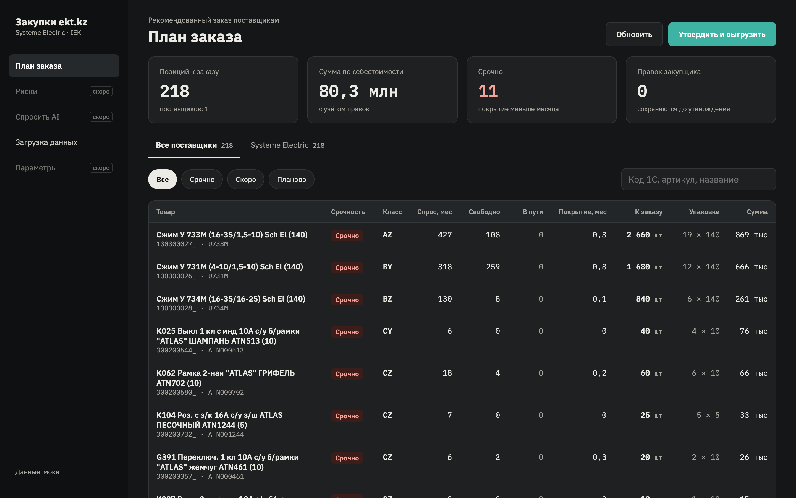
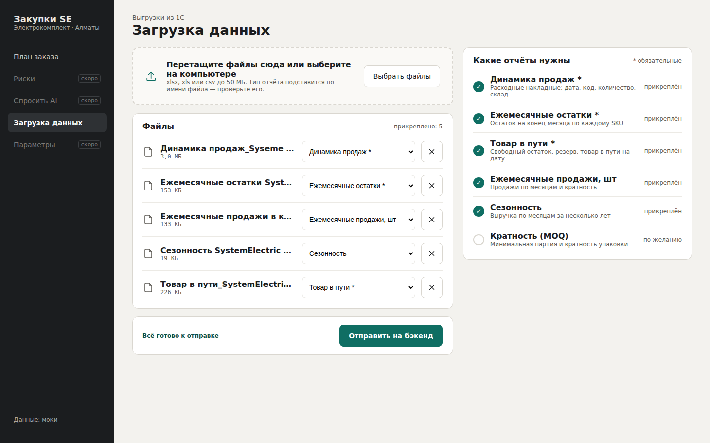
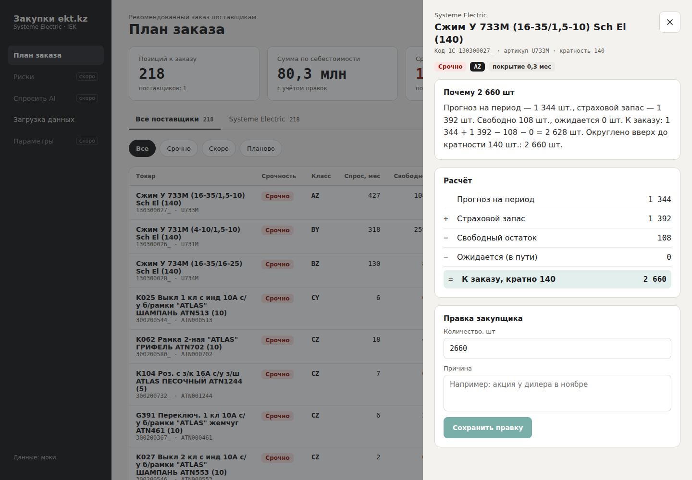

# Backend загрузки Excel

Hackathon team repository for VT2k15

Текущее приложение: Spring Boot + Kotlin + Gradle, Java 21. Принимает одним запросом 12 Excel-файлов (6 IEK и 6 Systeme Electric) и сохраняет исходные байты в памяти. Содержимое Excel не разбирается, БД нет.

## Запуск backend

Нужен JDK 21. Gradle устанавливать отдельно не нужно: wrapper включён в проект.

```powershell
.\gradlew.bat bootRun
```

На Linux/macOS: `bash ./gradlew bootRun`. Адрес по умолчанию: `http://localhost:8080`.

Проверка и сборка:

```powershell
.\gradlew.bat test bootJar
```

## Загрузка файлов

`POST /api/excel`, тип запроса `multipart/form-data`.

| Поле формы | Содержимое |
| --- | --- |
| `iekMoq` | IEK: MOQ / условия минимальной отгрузки |
| `iekSalesDynamics` | IEK: динамика продаж |
| `iekMonthlyStocks` | IEK: ежемесячные остатки |
| `iekMonthlySales` | IEK: ежемесячные продажи |
| `iekIncomingShipments` | IEK: товар в пути |
| `iekSeasonality` | IEK: сезонность |
| `systemeMoq` | Systeme Electric: MOQ / кратность |
| `systemeSalesDynamics` | Systeme Electric: динамика продаж |
| `systemeMonthlyStocks` | Systeme Electric: ежемесячные остатки |
| `systemeMonthlySales` | Systeme Electric: ежемесячные продажи |
| `systemeIncomingShipments` | Systeme Electric: сводный файл «Товар в пути» |
| `systemeSeasonality` | Systeme Electric: сезонность |

Каждое из 12 полей обязательно и должно содержать ровно один непустой файл с расширением `.xlsx` (регистр не важен). Роль и поставщик файла определяются **именем поля формы**, а не именем загруженного файла. Имена файлов и даты в них могут меняться; порядок полей не важен. Общие поля `iekFiles` и `systemeFiles` для загрузки больше не используются.

В памяти сохраняется типизированный комплект: группы `IekFiles` и `SystemeFiles`, в каждой — `moq`, `salesDynamics`, `monthlyStocks`, `monthlySales`, `incomingShipments`, `seasonality`. У каждого из 12 файлов свой конкретный Kotlin-тип, например `IekMoqFile` или `SystemeSeasonalityFile`, с исходными `fileName` и `content`. Excel пока не разбирается: заголовки, листы и фактическое соответствие содержимого заявленному типу отчёта не проверяются.

Успешный ответ `200 OK`:

```json
{"iekFiles":6,"systemeFiles":6,"totalFiles":12}
```

Отсутствующее или повторённое обязательное файловое поле, лишнее файловое поле, пустой файл или другое расширение: `400 Bad Request` с объяснением. Лимит одного файла — 20 MiB, всего запроса — 150 MiB; превышение даёт `413`. Multipart-файлы в допустимых пределах удерживаются в памяти.

В памяти хранится последний успешно загруженный комплект. Новая успешная загрузка заменяет его целиком; ошибочная не изменяет предыдущий. После перезапуска приложения данные исчезают. Получение файлов обратно и другая обработка в текущую версию не входят.

Загрузить предоставленные файлы из корня проекта (PowerShell, при запущенном backend):

```powershell
$filesByField = [ordered]@{
    iekMoq = 'task spec/IEK/MOQ  ИЭК.xlsx'
    iekSalesDynamics = 'task spec/IEK/Динамика продаж_2025-2026.xlsx'
    iekMonthlyStocks = 'task spec/IEK/Ежемесячные остатки продукции за последние 2 года  ИЭК.xlsx'
    iekMonthlySales = 'task spec/IEK/Ежемесячные продажи в количественном выражении за последние 2 года.xlsx'
    iekIncomingShipments = 'task spec/IEK/Путь ИЭК 22.09.2026.xlsx'
    iekSeasonality = 'task spec/IEK/Сезонность ИЭК.xlsx'
    systemeMoq = 'task spec/Systeme electric/MOQ SystemElectric.xlsx'
    systemeSalesDynamics = 'task spec/Systeme electric/Динамика продаж_Syseme Electric_2025-2026.xlsx'
    systemeMonthlyStocks = 'task spec/Systeme electric/Ежемесячные остатки SystemElectric 2024-2026.xlsx'
    systemeMonthlySales = 'task spec/Systeme electric/Ежемесячные продажи в кол-м выражении SystemElectric 2024-2026.xlsx'
    systemeIncomingShipments = 'task spec/Systeme electric/Товар в пути_SystemElectric на 22.09.2026.xlsx'
    systemeSeasonality = 'task spec/Systeme electric/Сезонность SystemElectric 2024-2026.xlsx'
}
$uploadArgs = @('--fail-with-body', 'http://localhost:8080/api/excel')
foreach ($entry in $filesByField.GetEnumerator()) {
    $file = Get-Item -LiteralPath $entry.Value -ErrorAction Stop
    $uploadArgs += @('-F', "$($entry.Key)=@$($file.FullName)")
}
& curl.exe @uploadArgs
```

Пример для frontend (маршрут `/api` направить на backend через dev proxy):

```javascript
// iek и systeme содержат выбранные пользователем объекты File по роли отчёта.
const filesByField = {
  iekMoq: iek.moq,
  iekSalesDynamics: iek.salesDynamics,
  iekMonthlyStocks: iek.monthlyStocks,
  iekMonthlySales: iek.monthlySales,
  iekIncomingShipments: iek.incomingShipments,
  iekSeasonality: iek.seasonality,
  systemeMoq: systeme.moq,
  systemeSalesDynamics: systeme.salesDynamics,
  systemeMonthlyStocks: systeme.monthlyStocks,
  systemeMonthlySales: systeme.monthlySales,
  systemeIncomingShipments: systeme.incomingShipments,
  systemeSeasonality: systeme.seasonality,
};
const formData = new FormData();
for (const [field, file] of Object.entries(filesByField)) {
  if (!(file instanceof File)) throw new Error(`Выберите файл для ${field}`);
  formData.append(field, file);
}

const response = await fetch('/api/excel', {
  method: 'POST',
  body: formData,
});
// Content-Type вручную не задаём: браузер добавляет multipart boundary.
const result = await response.json();
if (!response.ok) throw new Error(result.detail ?? 'Не удалось загрузить файлы');
```

Скелет проекта создан через [Spring Initializr](https://start.spring.io/). Настройки загрузки соответствуют [multipart properties Spring Boot](https://docs.spring.io/spring-boot/appendix/application-properties/index.html).

## Team members

- Nagmetulla Temirlan
- Orynbassar Onggar
- Gabit Bolatkhan

## Сущности

## Что в репозитории

| Путь | Что это |
| --- | --- |
| `src/main/kotlin/` | REST endpoint и хранение исходных файлов в памяти |
| `src/test/kotlin/` | Проверки приёма файлов и сохранения байтов |
| `build.gradle.kts` | Сборка backend |
| `docs/design.md` | Дизайн решения: проблема, находки в данных, архитектура, алгоритм, AI-слой, план |
| `design/` | Макеты экранов: план заказа, карточка SKU, риски, параметры |
| `prototype/order_prototype.py` | Прототип расчёта заказа на реальных выгрузках |
| `frontend/` | Веб-интерфейс: загрузка выгрузок, план заказа, карточка позиции, утверждение |

## Фронтенд



```bash
cd frontend
npm install
npm run dev
```

Откройте http://localhost:5173 — интерфейс работает на моках, бэкенд не нужен. С настоящим бэкендом: `VITE_USE_MOCKS=false BACKEND_URL=http://localhost:8000 npm run dev`.

Каждый цикл менеджер загружает по 6 отчётов на поставщика (Systeme Electric и IEK). Можно загрузить одного поставщика целиком или обоих — поставщик берётся по принципу «всё или ничего».

| Загрузка данных | Карточка позиции |
| --- | --- |
|  |  |

Экраны, сценарии моков и контракт API — в [frontend/README.md](frontend/README.md).

## Предыдущий Python-прототип расчёта (отдельно от backend)

Этот прототип не вызывается REST-приложением. Расчёт заказа ещё не подключён к backend.

```bash
pip install -r prototype/requirements.txt
# положить выгрузки 1С в data/raw/ (в git не коммитятся)
python prototype/order_prototype.py --data data/raw --lead-days 60 --review-days 30
```

На выгрузке от 22.09.2026 при L = 60 и R = 30 дней: 218 строк на 80,3 млн по себестоимости, из них 65 строк класса A на 61,5 млн.
