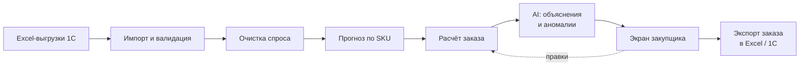

# SystemElectric — AI-планировщик закупок: дизайн решения

23.09.2026 · Живая версия документа: https://claude.ai/code/artifact/de90798c-c59f-403e-8c23-fd86ee881b08

## Проблема и цель

Решение — сервис, который раз в цикл сам считает заказ поставщику по каждому из ~500 SKU и объясняет каждую строку. Сейчас это делается вручную в Excel-шаблоне («Товар в пути»), и шаблон ломается на реальных данных:

- **Колонка «Заказ» пустая у всех 497 SKU** — шаблон собирает данные, но решения не даёт.
- **Коэффициенты роста и сезонности считаются по SKU из шумных помесячных продаж** и уходят в минус (от −18 до 43). Отрицательная сезонность физически бессмысленна.
- **Возвраты и отрицательные продажи** (−23, −68 в отдельных месяцах) смешаны со спросом.
- **Дефицит маскирует спрос:** в месяцы с нулевым остатком продажи занижены, и прогноз учится на заниженных цифрах.
- **Кратность (MOQ), товар в пути и резервы** лежат в разных файлах и сводятся руками.

Цель: закупщик за 15 минут утверждает заказ, где каждая строка кратна упаковке и учитывает остатки, резерв, товар в пути и сезон, а система объясняет, почему заказано именно столько.

Открытые вопросы: срок поставки от Systeme Electric (по умолчанию 60 дней), частота заказов (по умолчанию раз в месяц), бюджетные ограничения.

## Что показали данные

11% месяцев продаваемые SKU стоят с нулевым остатком, а 19% стоимости запаса (28 млн из 150 млн по себестоимости) лежит с покрытием больше года.

| Файл | Что внутри | Роль в решении |
| --- | --- | --- |
| Динамика продаж | 77 309 строк расходных накладных, 25 880 документов, 565 SKU, склад Алматы, янв 2023 – 22.09.2026 | Спрос по дням, размер заказов, выбросы-проекты |
| Ежемесячные продажи (шт) | 557 SKU × 33 месяца, кратность | Основной ряд для прогноза |
| Ежемесячные остатки | 704 SKU × 33 месяца | Месяцы дефицита, восстановление спроса |
| Сезонность | Выручка по месяцам 2024–2026 | Сезонный профиль компании |
| Товар в пути на 22.09 | 497 SKU: продажи, склады, резерв, свободный остаток, в пути, себестоимость | Текущий шаблон, точка входа |
| MOQ | 554 SKU, кратность 1–120 (чаще 5 и 10) | Округление заказа |

Продажи 2025 выросли на 12% к 2024, но январь–август 2026 на 18% ниже того же периода 2025. Поэтому среднее за 12 месяцев × сезонность прошлого года не годится — прогноз должен учитывать текущий тренд.

- **ABC×XYZ:** 67 SKU класса A дают 80% оборота, из них 43 со стабильным спросом (X). В классе C 221 из 280 SKU — нерегулярный спрос (Z).
- **Риск дефицита:** у 60 SKU классов A и B свободный остаток плюс товар в пути покрывают меньше двух месяцев продаж.
- **Неликвид:** 24 SKU без продаж 12 месяцев держат 4,5 млн по себестоимости.
- **Товар в пути** есть только по 7 SKU; по коробкам IMT35150 и IMT35151 в пути 37 800 и 12 000 шт.
- **Коды:** файлы связываются по `Код 1с` / `Номенклатура.Код`, но в остатках 704 SKU против 497 в шаблоне.

## Архитектура

Заказ считает детерминированный движок; LLM только объясняет цифры и ищет аномалии и никогда не меняет количество сама. Закупщик может переписать строку, правка сохраняется с причиной.



| Слой | Что делает | Технология |
| --- | --- | --- |
| Импорт | Читает 6 xlsx как есть, ищет строку заголовка, приводит коды и месяцы к единому виду, отчёт о расхождениях | pandas, pydantic |
| Хранилище | sku, sales_daily, sales_monthly, stock_monthly, in_transit, moq, order_line, override | DuckDB |
| Прогноз | Очистка, сезонность, тренд, метод по сегменту ABC×XYZ, бэктест | statsforecast (ETS, Croston/TSB) |
| Заказ | Страховой запас, точка заказа, целевой запас, кратность, лимит бюджета | Python, чистые функции |
| AI | Объяснение строки, сводка, аномалии, вопросы к данным | LLM с tool-calling поверх функций движка |
| API и UI | План заказа, карточка SKU, риски, параметры, экспорт | FastAPI + React |

## Алгоритм расчёта заказа

Заказ = целевой запас на срок поставки плюс период до следующего заказа, минус то, что уже есть и едет, округлённое вверх до кратности. По умолчанию L = 60 дней, R = 30 дней.

1. **Очистка спроса.** Возвраты не уменьшают прогноз. Месяцы с нулевым остатком помечаются дефицитными, спрос в них восстанавливается. Разовые отгрузки больше 3× медианного месячного спроса — проектные, из базы исключаются. Неполный месяц (сентябрь 2026) не участвует.
2. **ABC×XYZ.** ABC по обороту в себестоимости за 12 месяцев (80/15/5%), XYZ по коэффициенту вариации (до 0,5 / до 1 / выше).
3. **Прогноз.** X и Y: ETS по ряду без сезона × сезонный индекс. Z: TSB. Сезонный индекс — на уровне компании и серии (ATLAS, ArtGallery, City 9…), в диапазоне 0,5–1,5.
4. **Страховой запас:** A — 97%, B — 95%, C — 90%, CZ — под заказ клиента.
5. **Заказ с кратностью** — формулы ниже.
6. **Лимит бюджета:** строки сокращаются по приоритету «риск дефицита × оборот», CZ первыми.

```
D(L+R) = Σ прогноз по месяцам горизонта
SS     = z(сервис) · σ(мес) · √((L+R)/30)
S*     = D(L+R) + SS
A      = свободный остаток + в пути
Q      = ⌈ max(0, S* − A) / MOQ ⌉ · MOQ
```

Если потребность меньше 30% упаковки, а остатка хватает дольше L, строка переносится на следующий заказ.

**Бэктест.** Движок прогоняется на истории окт 2025 – авг 2026 как будто заказывал каждый месяц: WAPE, смещение, доля удовлетворённого спроса и средняя стоимость запаса против факта.

## AI-слой

| Функция | Пример | На чём строится |
| --- | --- | --- |
| Объяснение строки | «K067 розетка ATLAS карбон: спрос ~1 330 шт/мес, октябрь–декабрь с учётом сезона — 4 190 шт, страховой запас 1 550. Свободно 3 875, в пути 0 → заказ 1 870 шт (187 упаковок по 10)» | Факты расчёта |
| Сводка по заказу | «Черновик: 218 строк на 80 млн по себестоимости, 77% суммы — 65 позиций класса A» (прототип, L = 60) | Агрегаты по сегментам и сериям |
| Аномалии | Сжим U733M (AZ): страховой запас выше 3 месяцев продаж — проверить; проектные отгрузки; товар в пути больше годового спроса | Правила + статистика; LLM формулирует |
| Вопросы к данным | «Что будет, если поставка займёт 90 дней?» | Агент: запрос к DuckDB, пересчёт |
| Учёт правок | Причина правки попадает в историю и подсказки следующего цикла | Таблица override |

Без LLM всё, кроме свободных вопросов, работает на шаблонах.

## Экраны

Макеты — в папке `design/` (формат Design-канваса, живая версия: https://claude.ai/artifact/BA3GbY4Xirgb3Gnoo5x1KX).

| Экран | Что на нём | Главное действие |
| --- | --- | --- |
| План заказа | 4 итога, AI-сводка, таблица строк с покрытием до и после | Утвердить и выгрузить в 1С / Excel |
| Карточка SKU | 12 месяцев продаж + прогноз, расчёт по шагам, объяснение | Принять расчёт или правка с причиной |
| Риски | Скоро закончится, избыток, неликвид, аномалии | Выгрузить список |
| Параметры | Срок поставки, период, бюджет, сервис, пороги очистки | Сохранить и пересчитать |

## План и риски

1. Импорт и сверка файлов, отчёт о расхождениях кодов.
2. Очистка спроса и сегментация; заказчик проверяет ABC×XYZ.
3. Прогноз и бэктест против «среднее за 12 месяцев × сезонность».
4. Расчёт заказа с кратностью и бюджетом, экспорт в формат текущего шаблона.
5. UI и AI-объяснения.
6. Пилот: два цикла параллельно с Excel.

| Риск | Что делаем |
| --- | --- |
| Неизвестен срок поставки и его разброс | Параметр; позже — по датам заказа и прихода |
| Продажи только по складу Алматы, остатки по четырём складам | Один общий склад; перемещения — следующий этап |
| Покрытие 4–6 мес после поставки | Подобрать сервис и L+R на бэктесте; лимит бюджета |
| Нет клиентов в накладных | Проектные отгрузки по размеру строки; код клиента улучшит очистку |
