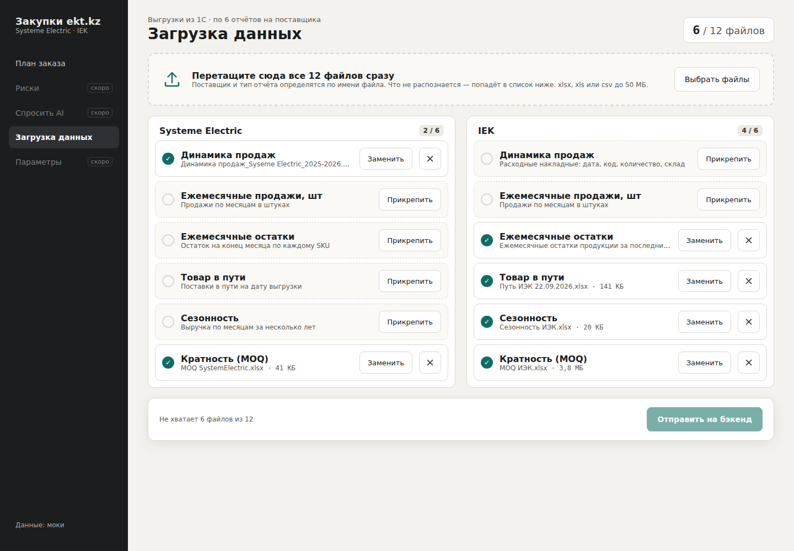
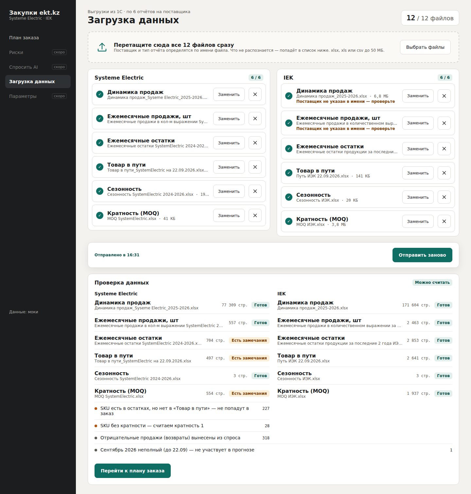
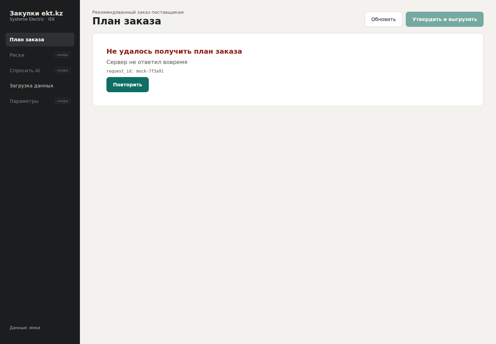
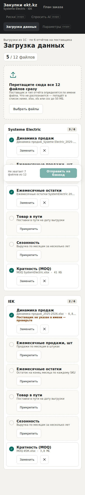
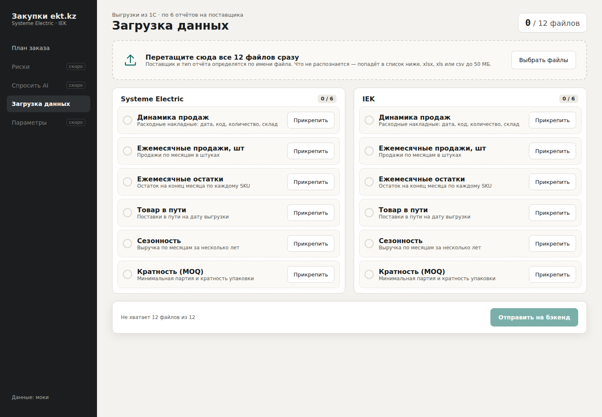

# Закупки ekt.kz — фронтенд

Веб-интерфейс менеджера по закупкам: загрузить 12 выгрузок из 1С (по 6 на Systeme Electric и IEK) → получить рекомендованный заказ с обоснованием по каждой позиции → поправить → утвердить и выгрузить.
Все данные приходят с бэкенда; пока он не готов, работают моки (MSW) на реальных цифрах SystemElectric.


## Быстрый старт

Нужен Node.js 20+.

```bash
cd frontend
npm install
npm run dev
```

Откройте http://localhost:5173. Моки включены по умолчанию, бэкенд не нужен.

> В zsh не добавляйте к команде комментарий через `#` — он уйдёт в vite как аргумент.

### С настоящим бэкендом

```bash
cp .env.example .env.local        # VITE_USE_MOCKS=false
BACKEND_URL=http://localhost:8000 npm run dev
```

Запросы `/api/*` проксируются на `BACKEND_URL` (по умолчанию `http://localhost:8000`).

### Сборка

```bash
npm run build      # проверка типов + сборка в dist/
npm run preview    # посмотреть собранную версию
```

## Экраны

### Загрузка данных — `#/import`

Каждый цикл менеджер загружает **12 файлов: по 6 отчётов на каждого поставщика** (Systeme Electric и IEK). Все 12 обязательны.

| Отчёт | Что внутри |
| --- | --- |
| Динамика продаж | Расходные накладные: дата, код, количество, склад |
| Ежемесячные продажи, шт | Продажи по месяцам в штуках |
| Ежемесячные остатки | Остаток на конец месяца по каждому SKU |
| Товар в пути | Поставки в пути на дату выгрузки |
| Сезонность | Выручка по месяцам за несколько лет |
| Кратность (MOQ) | Минимальная партия и кратность упаковки |

Как это работает:

1. Перетащите все 12 файлов в общую зону. Поставщик и тип отчёта определяются по имени файла (`ИЭК`/`IEK`, `SystemElectric`/`Syseme Electric`; «Динамика», «остатки», «в пути»…).
2. Если поставщика в имени нет, файл кладётся в единственный свободный слот этого типа — с пометкой «проверьте».
3. Что не распознано, попадает в «Не распознаны»: там выбирают, в какой слот положить. Заменённый файл возвращается в этот список, а не теряется.
4. В любой слот можно перетащить файл или прикрепить его кнопкой. Слот предупреждает, если имя файла указывает на другого поставщика или другой отчёт.
5. «Отправить на бэкенд» активна, когда заполнены все 12 слотов и нет лишних файлов.



После отправки бэкенд возвращает результат проверки по каждому поставщику: строки по файлам и замечания. Замечания не блокируют расчёт, ошибки — блокируют.



### План заказа — `#/`

Итоги, вкладки по поставщикам, фильтр срочности, поиск. Клик по строке открывает карточку позиции.

### Карточка позиции

Обоснование от бэкенда, расчёт по шагам, правка количества с причиной — с проверкой кратности упаковки.


### Утверждение

Заказ не уходит поставщику автоматически: после подтверждения фронт отправляет `POST /api/orders/approve` по каждому поставщику и скачивает CSV для 1С (разделитель `;`, UTF-8 с BOM).

### Состояния

Загрузка (скелетон), пусто, ошибка с `request_id` и повтором. Тёмная тема по системной настройке, вёрстка до ширины телефона.

| Ошибка | Телефон |
| --- | --- |
|  |  |

Пустой экран загрузки:



## Сценарии моков

Параметр в адресе страницы:

| URL | Что показывает |
| --- | --- |
| `/` | План: 218 позиций Systeme Electric + предлагаемые поля |
| `/?mock=base` | Только поля из `docs/front data.txt` — так UI выглядит на текущем контракте |
| `/?mock=slow` | Долгая загрузка (скелетон, прогресс отправки) |
| `/?mock=empty` | Пустой список заказа |
| `/?mock=error` | 503 при загрузке плана |
| `/?mock=upload-error#/import` | 422 при отправке файлов |

Моки загрузки возвращают реальные цифры по выгрузкам обоих поставщиков от 22.09.2026.

## Контракт с бэкендом

| Запрос | Тело | Ответ |
| --- | --- | --- |
| `POST /api/imports` | `multipart/form-data`, 12 полей: имя = `поставщик.тип` (`systeme.sales_tx`, `iek.moq`, …; поставщики `systeme`, `iek`; типы `sales_tx`, `sales_monthly`, `stock_monthly`, `in_transit`, `seasonality`, `moq`), значение = файл | `ImportResult` с `supplier_id` у каждого файла и замечания |
| `GET /api/orders` | — | `{ items: OrderItem[] }` |
| `POST /api/orders/approve` | `{ supplier_id, lines: [{ erp_code, order_qty, reason? }] }` | `{ order_id, approved_at }` |

Ошибки: `{ error: { code, message, request_id } }`. Типы — в `src/api/types.ts`.

`OrderItem` из `docs/front data.txt`: `erp_code`, `supplier_id`, `supplier_name`, `supplier_article`, `name`, `unit`, `order_qty`, `explanation`.
Необязательные поля, которые UI уже показывает, если бэкенд их пришлёт: `urgency`, `abc_xyz`, `forecast_qty`, `safety_stock`, `free_stock`, `in_transit`, `moq`, `demand_per_month`, `cover_months`, `unit_cost`. Нет поля — нет колонки.

Пути `/api/imports` и `/api/orders/approve` и имена полей multipart — предложение, согласовать с бэкендом. Поставщики и типы отчётов задаются в `src/api/reports.ts`.

## Структура

```text
src/
├── api/          # типы контракта, fetch/XHR-клиент, справочник типов отчётов
├── mocks/        # MSW: обработчики и данные (orders.json — 218 позиций из прототипа)
├── pages/        # ImportPage, PlanPage
├── components/   # таблица, карточка позиции, диалог утверждения, состояния, навигация
├── exportCsv.ts  # выгрузка для 1С
└── styles.css    # токены цветов (светлая и тёмная тема) и вёрстка
```

Риски, «Спросить AI» и параметры есть в макете (`design/`), в навигации помечены «скоро».
